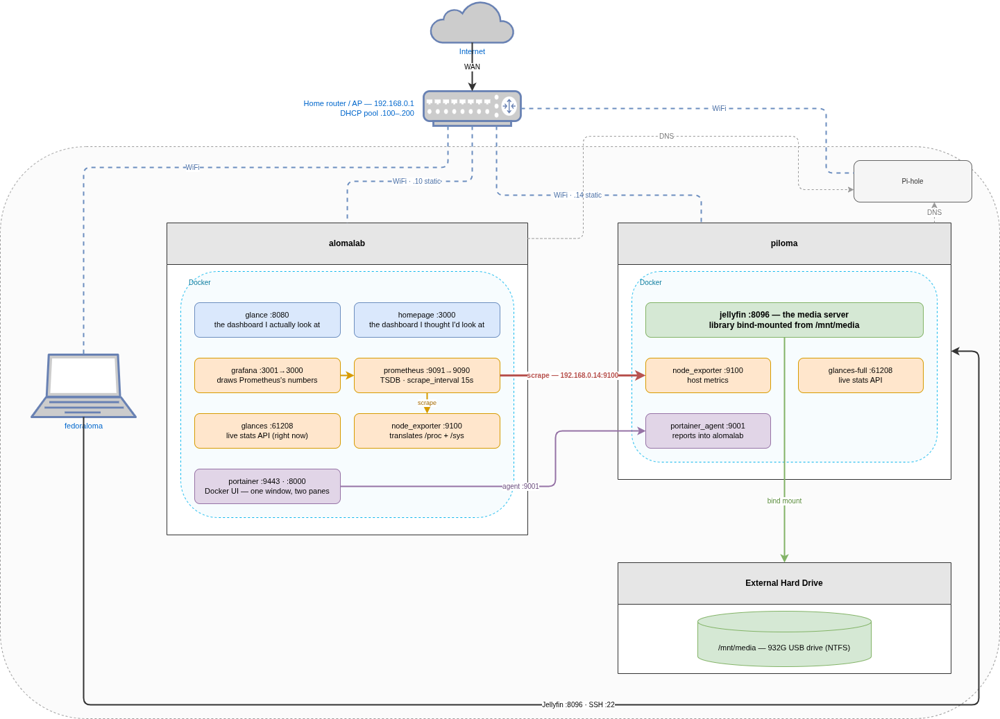

I was scavenging through my mom's drawers and found her old laptops that's as good as an E-Waste. Then, I have another Raspberry Pi that has become my edge servers for my *syncthing*. So, I decided to combine both of them as my media server.

## TLDR
It'll probably look something like this:


## The two machines
|               | piloma                         | alomalab                             |
| ------------- | ------------------------------ | ------------------------------------ |
| Hardware      | Raspberry Pi 5 Model B Rev 1.0 | Acer Aspire ES1-131                  |
| CPU           | Cortex-A76, 4C/4T, arm64       | Celeron N3050, 2C/2T @ 1.6GHz, amd64 |
| RAM           | 2.0Gi                          | 1.5Gi                                |
| OS            | Debian 13 (trixie)             | Ubuntu 26.04 LTS                     |
| Root disk     | 29G SD card (`/dev/mmcblk0p2`) | 109G ext4 (`/dev/sda2`)              |
| Extra storage | 932G USB drive at `/mnt/media` | —                                    |
| IP            | 192.168.0.14                   | 192.168.0.10                         |

Most intuitive name that I can think of. In fact, my other devices are also named like that. 

Both of this device has different CPU architectures which is part of the reason I am creating this lab; to deal with multi-architecture setup. So, every container that must run on the nodes must have support for both of these architectures. If not,

> *When there is a will, there is a way*


## Prepping the Pi

This is the same as step as [Getting Started With Raspberry Pi](https://www.raspberrypi.com/documentation/computers/getting-started.html). 

When picking the os, it's better to use Raspberry Pi OS Lite (64-bit), as it's less bloat and 
Lite means no desktop. You will never look at this machine's screen for this setup. So it's worth the extra performance

|                    | Raspberry Pi OS Lite (64-bit)     | Raspberry Pi OS Desktop (64-bit)             |
| ------------------ | --------------------------------- | -------------------------------------------- |
| Desktop            | None — text console only          | Wayfire/labwc desktop, file manager, browser |
| Image download     | ~0.5G                             | ~1.2G (~2.7G with recommended software)      |
| Disk after install | ~2.5G                             | ~7G (~11G with recommended software)         |
| Idle RAM           | ~100–150M                         | ~450–600M                                    |
| Preinstalled apps  | Base system, SSH, package manager | Chromium, VLC, Thonny, LibreOffice (full)    |
| How you access it  | SSH or serial console             | HDMI + keyboard, VNC, or SSH                 |
| Good for           | Headless servers, Docker hosts    | A Pi you actually sit in front of            |

Numbers are obtained from my past measurement, take it with a grain of salt; the ratio is the point. On a
2GB Pi, the desktop image spends a quarter of your RAM drawing a login screen
nobody logs into, plus a Debian-based OS.

Making it as a network-based media server demands a huge load in storage and my pocket. I don't really have enough money to formally setup a NAS currently. So I'm mounting my existing external hard disk to the Raspberry Pi.

Normally, you would mount the external hard disk using the command:

```bash
sudo mount -m /dev/sda1 /mnt/media
```

But, you can automatically mount it when it's connected and Raspberry Pi boots up.

1. Check the block devices
```bash
lsblk -f
```

```
NAME        FSTYPE FSVER LABEL UUID                                 MOUNTPOINTS
mmcblk0
├─mmcblk0p1 vfat   FAT32       A1B2-C3D4                            /boot/firmware
└─mmcblk0p2 ext4   1.0         8f3c1a2e-...                         /
sda
└─sda1      ntfs         media <YOUR-UUID>                          /mnt/media
```

Take note of `UUID=2E4A9C1B4A9BE2F0`

Then add it to `/etc/fstab` by UUID, never by `/dev/sda1`:

```bash
echo 'UUID=<YOUR UUID>  /mnt/media  ntfs-3g  defaults,nofail,uid=1000,gid=1000  0  0' | sudo tee -a /etc/fstab
```

Take note of the flags used:

- `nofail` — boot even if the drive is missing. Without this, unplugging the
  drive means the Pi hangs at boot waiting for a filesystem, and now you *do*
  need that keyboard and monitor.
- `uid=1000,gid=1000` — NTFS has no Unix permissions, so ownership is assigned
  at mount time. Skip this and everything is owned by root and Jellyfin can't
  read the library.

Device names like `/dev/sda1` are assigned in the order the kernel finds
things. Plug in a second drive and yesterday's `sda1` is today's `sdb1`. The
UUID is written into the filesystem itself and doesn't move.

## Prepping the laptop

Ubuntu Server 26.04, minimal install, no desktop. Same reasoning as the Pi:
2GB of RAM does not have room for GNOME and Prometheus, and the former is more important.

If you're unsure with installing Ubuntu Server, follow this [guide](https://ubuntu.com/tutorials/install-ubuntu-server#1-overview)

### WiFi on a headless server

The laptop is not equipped with an ethernet port, netplan is the answer(to configure your wifi, static ip and so on).
`/etc/netplan/00-installer-config.yaml`:

```yaml
network:
  version: 2
  renderer: NetworkManager
  wifis:
    wlp2s0:
      dhcp4: false
      addresses:
        - 192.168.0.10 # Set a static IP Address for your own good
      routes:
        - to: default
          via: 192.168.0.1
      nameservers:
        addresses: [192.168.0.2]
      access-points:
        "YOUR_SSID":
          password: "YOUR_PASSWORD"
```

Apply it with:

```bash
sudo netplan apply
```

**Static, not DHCP.** This is the one decision in the file worth arguing about,
so here's the argument. A server is a thing other things point *at*. This
address is going to end up in my SSH config, in Prometheus scrape targets, in
DNS records, and in another machine's config files. An address that can change
underneath all of that is not an address, it's a suggestion.

The pieces, since netplan's static syntax is less obvious than `dhcp4: true`:

- `dhcp4: false` — stop asking the router, we're deciding this ourselves.
- `addresses` — the address *and* the prefix. `/24` says the first three octets
  are the network, so everything `192.168.0.x` is a local neighbour reachable
  directly.
- `routes: to: default` — where to send anything that isn't a local neighbour.
  That's the router. Omit this and the machine can talk to your LAN and nothing
  else, which is a confusing way to have no internet.
- `nameservers` — my Pi-hole. This matters more in [post
  2](/blog/homelab/02-transition-to-kubernetes/), where it becomes how the whole
  lab resolves internal names.

Based on my experience, most routers has something like `.100-200` DHCP pool by default, so pick your static addresses outside your pool. This is safer as your device won't be possibly be arguing with other devices to use an autoconfigured Ip Addresses.


**A server on WiFi is a compromise.** It's a shared, lossy medium with variable
latency, and later on I put a Kubernetes control plane connection across it.
It works. It is not what I would choose if the shelf had an ethernet port
nearby.

### Closing the lid without killing the server

This is the single most important line of config on a laptop server, and it's
easy to miss until the first time you tidy up your desk and take the whole
homelab down with you.

By default, systemd suspends the machine when you close the lid. Create
`/etc/systemd/logind.conf.d/99-homelab.conf`:

```ini
[Login]
HandleLidSwitch=ignore
HandleLidSwitchDocked=ignore
HandleLidSwitchExternalPower=ignore
```

Then:

```bash
sudo systemctl restart systemd-logind
```

Three settings because systemd distinguishes three situations: on battery,
docked, and on external power. Setting only the first one means the server
still dies when it's plugged in, which is always.

Verify it took, rather than trusting me:

```bash
systemd-analyze cat-config systemd/logind.conf | grep -i lid
```


### SSH

Key-based auth only, on both machines. Generate a key on the laptop you
actually use:

```bash
ssh-keygen -t ed25519 -C "homelab"
ssh-copy-id -i /path/to/public_key username@ip_address
```

`ed25519` over RSA because the keys are shorter, the crypto is modern, and
there is no reason to pick the other one in 2026. Also, my crypto lecturer used to glaze on ed25519 so much that he believed that it can be used for [QKD](https://en.wikipedia.org/wiki/Quantum_key_distribution)

Then harden `/etc/ssh/sshd_config` on each node:

```
PasswordAuthentication no
PermitRootLogin no
```

```bash
sudo systemctl restart ssh
```

Do not close your existing SSH session until you've opened a second one and
confirmed the key works. If you lock yourself out of a headless machine, the
recovery procedure involves finding a monitor, and the whole point of this
setup is never needing one.

The last piece is `~/.ssh/config` on my workstation, which turns two IP
addresses I will not remember into two words I will:
## The services

Everything runs in Docker, one directory per service , each with its own compose file. Config is
bind-mounted from the host so I can edit a YAML file over SSH and have the app
pick it up.

Here's what ended up running on alomalab:

| Service       | Image                          | Port       | What it's for                       |
| ------------- | ------------------------------ | ---------- | ----------------------------------- |
| glance        | `glanceapp/glance`             | 8080       | The dashboard I actually look at    |
| homepage      | `ghcr.io/gethomepage/homepage` | 3000       | The dashboard I thought I'd look at |
| grafana       | `grafana/grafana`              | 3001→3000  | Graphs                              |
| prometheus    | `prom/prometheus`              | 9091→9090  | Metrics storage and scraping        |
| node_exporter | `prom/node-exporter`           | 9100       | Host metrics                        |
| glances       | `nicolargo/glances`            | 61208      | Live system stats API               |
| portainer     | `portainer/portainer-ce`       | 8000, 9443 | Docker management UI                |

And on piloma:

| Service         | Image                    | What it's for                           |
| --------------- | ------------------------ | --------------------------------------- |
| jellyfin        | `jellyfin/jellyfin`      | Media server, library on `/mnt/media`   |
| glances         | `nicolargo/glances-full` | System stats API                        |
| node_exporter   | `prom/node-exporter`     | Host metrics                            |
| portainer_agent | `portainer/agent`        | Lets alomalab's Portainer see this node |

### Monitoring: what each piece actually does

This stack confused me for an embarrassingly long time, because four of these
tools all look like "system monitoring" from the outside. They are not the same
thing.

- **node_exporter** reads `/proc` and `/sys` and publishes them as text on
  `:9100/metrics`. It stores nothing. It has no UI. It is a translator.
- **Prometheus** scrapes that endpoint every 15 seconds and stores the numbers
  in a time-series database. It answers "what was memory usage at 3am".
- **Grafana** draws Prometheus's numbers as graphs. It stores no metrics.
- **Glances** is the *right now* view: an htop that also speaks HTTP. It answers
  "what is eating my CPU this second".


### Portainer

Portainer is a web UI for Docker. The reason it's here rather than just using
`docker ps` over SSH is the agent: install `portainer/agent` on piloma, add it
as an endpoint in the Portainer on alomalab, and one browser tab shows
containers on both machines.

That's genuinely useful, and it's also the first sign of the structural
problem. Two machines running Docker are two separate systems. Portainer
doesn't merge them, it just gives you one window with two panes.

## Where this leaves us

Two machines, about a dozen containers, one dashboard, and metrics going back a
few weeks. For a stack that cost nothing and runs on 3.5GB of combined RAM,
that's a genuinely good outcome, and if you stop here you have a real homelab.

But look at what's holding it together:

- Cross-node anything is a hardcoded IP address.
- Cross-node management is an agent reporting into a UI.
- Every port is unique because I remembered to make it unique.
- Nothing limits how much memory any container can take on a 1.5GB machine.
- If a host goes down, everything on it is simply gone until I notice.

Next post is about the week all five of those bit at once.
