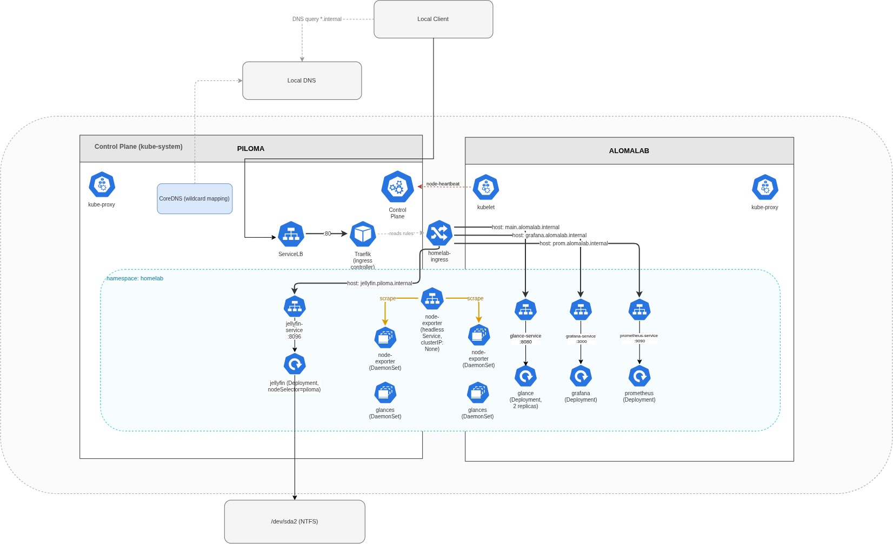

At the end of [the last post](/blog/homelab/03_setting_up_apps_kubernetes_way/) everything
was running and nothing was reachable. Eight pods, all healthy, all sitting
behind ClusterIP services that only exist inside the cluster's own network.

This post is about the last mile: getting from a browser on my phone to a pod,
by name, over port 80.

## Why not just use NodePorts

The quick fix is `type: NodePort`, which opens a high port on every node.
Jellyfin still has one, from before I set up ingress:

```
jellyfin-service   NodePort   10.43.17.44   8096:30676/TCP
```

That works. `http://192.168.0.14:30676` serves Jellyfin. And it's the same
trap as the Docker setup — an IP address and a port number I have to remember,
allocated from the `30000-32767` range, with a new one for every service.

I did this migration to stop memorising ports. So: ingress.

## What ingress actually is

An **Ingress** is a routing rule, not a program. It says "requests for
`grafana.alomalab.internal` go to `grafana-service:3000`". On its own it does
nothing at all, more like a registry.

An **ingress controller** is the program that reads those rules and does the
routing. k3s ships Traefik and enables it by default, which is the main reason
I didn't disable it in post 2.

So the pieces are:

1. Pi-hole resolves `grafana.alomalab.internal` → `192.168.0.10`
2. Traefik is listening on port 80 of that IP
3. Traefik reads the `Host:` header, matches an Ingress rule, forwards to the
   right service

Step 3 is what makes hostname routing work: **one port, many services**,
disambiguated by the hostname the browser sends.

## The ingress object

One Ingress with a rule per service:

```yaml
apiVersion: networking.k8s.io/v1
kind: Ingress
metadata:
  name: homelab-ingress
  namespace: homelab
spec:
  ingressClassName: traefik
  rules:
    - host: main.alomalab.internal
      http:
        paths:
          - path: /
            pathType: Prefix
            backend:
              service:
                name: glance-service
                port:
                  number: 8080
    - host: grafana.alomalab.internal
      http:
        paths:
          - path: /
            pathType: Prefix
            backend:
              service:
                name: grafana-service
                port:
                  number: 3000
    - host: prom.alomalab.internal
      http:
        paths:
          - path: /
            pathType: Prefix
            backend:
              service:
                name: prometheus-service
                port:
                  number: 9090
    - host: jellyfin.piloma.internal
      http:
        paths:
          - path: /
            pathType: Prefix
            backend:
              service:
                name: jellyfin-service
                port:
                  number: 8096
```

```bash
kubectl apply -f ingress.yaml
kubectl get ingress -n homelab
```

```
NAME              CLASS     HOSTS                                    ADDRESS                       PORTS
homelab-ingress   traefik   jellyfin.piloma.internal,main.alom...    192.168.0.10,192.168.0.14     80
```

Two details in that output are worth stopping on.

**`ADDRESS` lists both node IPs.** That's ServiceLB — the other component the
"lightweight k3s" guides tell you to disable. It runs a tiny proxy pod on every
node that forwards port 80 into Traefik, so Traefik answers on *both* machines
regardless of which one it's actually running on:

```
NAME      TYPE           CLUSTER-IP     EXTERNAL-IP                 PORT(S)
traefik   LoadBalancer   10.43.13.75    192.168.0.10,192.168.0.14   80:32759/TCP,443:30361/TCP
```

This is quietly doing something useful. Traefik itself is one pod on piloma,
but `main.alomalab.internal` points at alomalab and still works, because
alomalab's ServiceLB pod forwards it across. It also means my Pi-hole records
don't have to track which node Traefik landed on.

**`jellyfin.piloma.internal` is a naming inconsistency I'm going to regret.**
I named the hosts after the machine each service *used to* run on. That was
meaningful under Docker. Under Kubernetes the scheduler decides placement, and
Glance could move to piloma tomorrow while its URL still says `alomalab`. The
right scheme is `service.homelab.internal` with no node name in it at all. I
haven't fixed it yet, and the fix is four Pi-hole CNAMEs and four lines of YAML.

## Configuring DNS


When you find yourself saying things like *Damn, No Service(DNS)*, it's that DNS every time.

Since I only want to access those services locally, configuring it via the Local DNS (Pi-Hole) is sufficient.
### Step 1: find out which resolver is answering

The most useful debugging tool in Kubernetes is a throwaway pod:

```bash
kubectl run -it --rm debug --image=busybox:1.36 --restart=Never -- sh
```

`--rm` deletes it on exit, `--restart=Never` makes it a bare Pod rather than a
Deployment that would resurrect itself. From inside:

```
/ # nslookup grafana.alomalab.internal
Server:    10.43.0.10
Address:   10.43.0.10:53

** server can't find grafana.alomalab.internal: NXDOMAIN
```

```
/ # nslookup glance-service.homelab.svc.cluster.local
Server:    10.43.0.10
Address:   10.43.0.10:53

Name:      glance-service.homelab.svc.cluster.local
Address:   10.43.17.13
```

That pair of results localises the problem precisely. Cluster-internal DNS
works. External-to-the-cluster names don't. So CoreDNS is running and healthy
it just doesn't know about `.internal`.

### Step 2: understand what CoreDNS does with a name it doesn't own

CoreDNS answers for `*.cluster.local` from its own records. Anything else it
*forwards* upstream, and the default k3s Corefile forwards to whatever the node
has in `/etc/resolv.conf`:

```
forward . /etc/host/resolv.conf
```

On piloma, that file is managed by systemd-resolved and points at
`127.0.0.53`, a stub listener on the node's own loopback. From inside a pod
with its own network namespace, `127.0.0.53` is *the pod's* loopback, where
nothing is listening. The query goes nowhere.

### Step 3: tell CoreDNS about `.internal` explicitly

The fix is a stanza forwarding just that zone straight to Pi-hole, bypassing
resolv.conf entirely. k3s watches a ConfigMap for exactly this:

```yaml
apiVersion: v1
kind: ConfigMap
metadata:
  name: coredns-custom
  namespace: kube-system
data:
  internal.server: |
    internal:53 {
        errors
        cache 30
        forward . 192.168.0.2
    }
```

Use the `coredns-custom` ConfigMap rather than editing the `coredns` one directly 
as k3s manages that file and will overwrite your changes on the next restart,
which is a fun way to break your patience.

```bash
kubectl rollout restart deployment/coredns -n kube-system
```

Then re-run the busybox test. `cache 30` keeps 30 seconds of answers so a
dashboard polling every 10 seconds doesn't hammer Pi-hole.

## Performance

The whole point was fitting Kubernetes on hardware that shouldn't run it. So:

```bash
kubectl top nodes
```

```
NAME       CPU(cores)   CPU(%)   MEMORY(bytes)   MEMORY(%)
alomalab   370m         18%      925Mi           59%
piloma     86m          2%       1419Mi          70%
```

**370millicores and 59% memory ysage.** A full Kubernetes control plane, CoreDNS,
Traefik, metrics-server and Jellyfin, on a Raspberry Pi, costing 18% CPU at
idle. That number is the entire argument for k3s.

It fits with no room to spare, exactly as post 2 predicted. Adding Komga and
Syncthing means either resource limits everywhere or a RAM upgrade, and
realistically both.

Prometheus scrapes the node fine via node-exporter, so I have the data — it just
isn't reaching `kubectl top`. It's next on the list.

Worth stating what this cost in absolute terms: two machines, roughly 15W
combined, running continuously. The control plane overhead on the Pi is around
400MB of the 2GB.

## The architecture


Compare that to the Docker version, where the equivalent diagram had a hardcoded
IP address on every arrow crossing between the two boxes. The arrows are the
same. The difference is that none of them are addresses I maintain by hand any
more.

## What I'd tell someone starting this

**Kubernetes was not necessary and I'd do it again.** Eleven containers do not
need a scheduler. What they needed was service discovery, memory limits, and
one declarative source of truth, and Kubernetes happened to be the box those
three came in. If you only want those three things, Docker Compose with
`mem_limit` and a real DNS setup gets you most of the way for a fraction of the
concepts.

**k3s on a Pi is genuinely fine.** 2% CPU idle. The scary numbers you read
about Kubernetes overhead are about full upstream distributions with etcd, not
this.

**Do the DNS before the cluster.** Almost every problem in this series was a
naming problem wearing a different hat: the IP I renumbered, the hardcoded
Prometheus target, the `.internal` resolution failure. 

**Set resource limits on day one.** I migrated specifically because Compose
couldn't bound memory, then ran unbounded for a week anyway. Don't do that.

### Still on the list

- Komga/Kavita and Syncthing
- Manifests into Git, then something that applies them automatically
