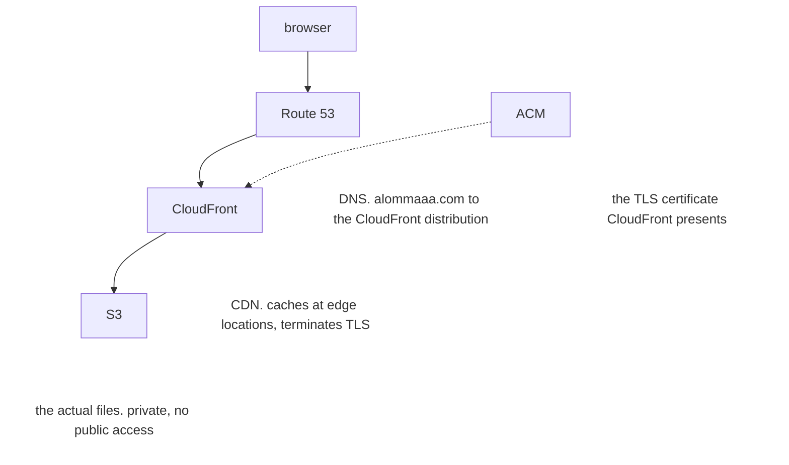

The build gives me a `dist/` folder. Now it needs to be on the internet, on
my domain, over HTTPS, without costing me anything meaningful.

There are easier ways to do this. Netlify, Vercel and Cloudflare Pages will
all take a git repo and hand you a URL in two minutes. I went with AWS
because I want to work in cloud infrastructure, and "I clicked deploy on
Vercel" is not a thing you put on a CV. Every piece below is something I'd
have to understand anyway.

## The shape of it

Four services, each doing one job:



The browser only ever talks to CloudFront. It never touches S3 directly,
and that's deliberate.

## S3

S3 is object storage. Buckets and keys, not really a filesystem, though it
looks close enough to one. My `dist/` folder gets synced into a bucket and
that's the whole story.

S3 has a "static website hosting" mode that will serve a bucket over plain
HTTP on an ugly regional URL. I'm not using it. It doesn't do HTTPS on a
custom domain, which rules it out immediately. Too simplistic for someone who likes to overengineer things.

Instead the bucket is completely locked down:

```hcl
resource "aws_s3_bucket_public_access_block" "site" {
  bucket = aws_s3_bucket.site.id

  block_public_acls       = true
  block_public_policy     = true
  ignore_public_acls      = true
  restrict_public_buckets = true
}
```

Four separate flags, all on. Public S3 buckets are the classic cloud
mistake, the one that shows up in a breach writeup every few months and got viral on. Even
though this bucket holds nothing but HTML I'd happily hand to a stranger,
getting into the habit of "buckets are private unless proven otherwise"
seemed worth it. The habit is the point.

## CloudFront and OAC

If the bucket is private, how does anyone read it?

Origin Access Control. CloudFront signs its requests to S3 with SigV4, and
the bucket policy allows exactly one principal: the CloudFront service, and
only when the request comes from *this specific distribution*.

```hcl
{
  Sid       = "AllowCloudFrontServicePrincipalReadOnly"
  Effect    = "Allow"
  Principal = { Service = "cloudfront.amazonaws.com" }
  Action    = "s3:GetObject"
  Resource  = "${aws_s3_bucket.site.arn}/*"
  Condition = {
    StringEquals = {
      "AWS:SourceArn" = aws_cloudfront_distribution.site.arn
    }
  }
}
```

The distribution itself:

```hcl
default_cache_behavior {
  allowed_methods        = ["GET", "HEAD"]
  cached_methods         = ["GET", "HEAD"]
  viewer_protocol_policy = "redirect-to-https"
  compress               = true
  cache_policy_id        = data.aws_cloudfront_cache_policy.caching_optimized.id
}
```

`GET` and `HEAD` only, because there is nothing here to POST to.
`redirect-to-https` bounces anyone who arrives on port 80. `compress` gives
gzip and brotli at the edge, which matters more than you'd think for a site
that's mostly text.

### The 403 thing

This one caught me out and it's worth knowing about.

When S3 is public and a key doesn't exist, you get a 404. When S3 is locked
down behind OAC and a key doesn't exist, you get a **403**, because from
S3's point of view "you may not know whether this object exists" is the
safer answer. So every typo'd URL on my site was returning "Forbidden"
instead of a 404 page.

The fix is to map both at the CloudFront layer:

```hcl
custom_error_response {
  error_code         = 403
  response_code      = 404
  response_page_path = "/404.html"
}

custom_error_response {
  error_code         = 404
  response_code      = 404
  response_page_path = "/404.html"
}
```

Now a bad URL gets my 404 page with an actual 404 status, which is what both
humans and crawlers expect.

## Route 53

The domain needs to resolve to CloudFront. In Route 53 that's an **alias
record**, not a CNAME.

The difference matters at the apex. DNS doesn't let you put a CNAME on
`alommaaa.com` itself, only on subdomains like `www`. Route 53's alias is an
AWS-specific record type that resolves to the distribution's addresses at
query time, and it's allowed at the apex. It's also free to query, where
normal records are billed per million.

Four records total: `A` and `AAAA` for the apex, `A` and `AAAA` for `www`.
The `AAAA` ones are IPv6, and the distribution has `is_ipv6_enabled = true`,
so there's no reason not to.

```hcl
resource "aws_route53_record" "apex_a" {
  zone_id = local.zone_id
  name    = var.domain_name
  type    = "A"

  alias {
    name                   = aws_cloudfront_distribution.site.domain_name
    zone_id                = aws_cloudfront_distribution.site.hosted_zone_id
    evaluate_target_health = false
  }
}
```

If you create the hosted zone with Terraform rather than buying the domain
through Route 53, remember to copy the four nameservers into your registrar.
Nothing resolves until you do, and the failure looks exactly like "my DNS is
broken" with no clue as to why. That's why there's an output for it:

```hcl
output "route53_nameservers" {
  description = "Only populated when create_route53_zone = true. Copy these into your registrar's nameserver settings."
  value       = var.create_route53_zone ? aws_route53_zone.this[0].name_servers : null
}
```

## What this costs

Roughly nothing, which was one of the goals.


- **CloudFront**: 1 TB out and 10 million requests per month, free, and it
  doesn't expire after twelve months like most of the free tier. A text site
  is not getting anywhere near that.
- **S3**: the built site is a few megabytes. Storage cost rounds to zero.
  Because CloudFront sits in front, S3 barely gets read at all.
- **Route 53**: $0.50/month for the hosted zone. This is the only line item
  that reliably shows up.
- **ACM**: free lol.

## Doing this by hand is miserable

Everything above, set up through the AWS console, is somewhere around forty
clicks across five services, in an order you have to know in advance, with
several values copy-pasted between tabs. I did it that way first, got it
working, and then could not have told you six weeks later exactly what I had
clicked.

Which is the next post.

[Next post](/blog/website/03-terraform/): putting all of it in Terraform so
it can be destroyed and rebuilt on demand.
